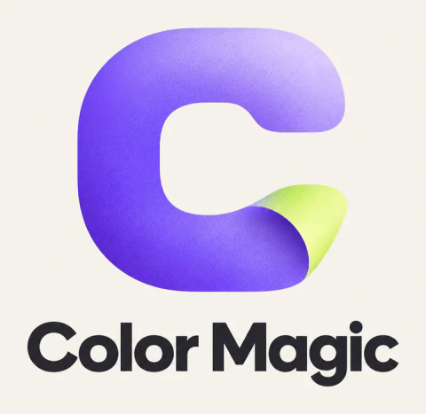
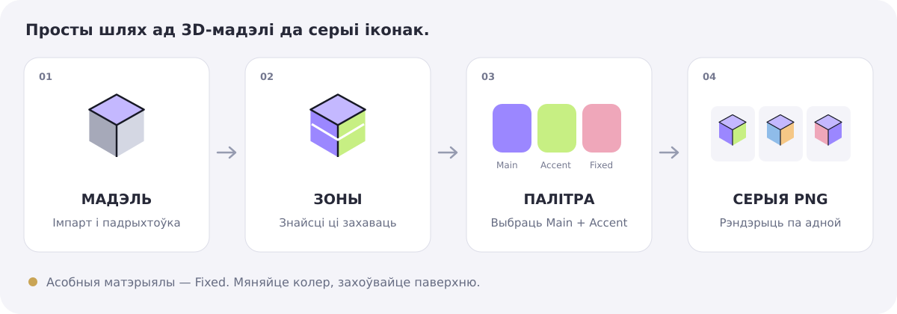
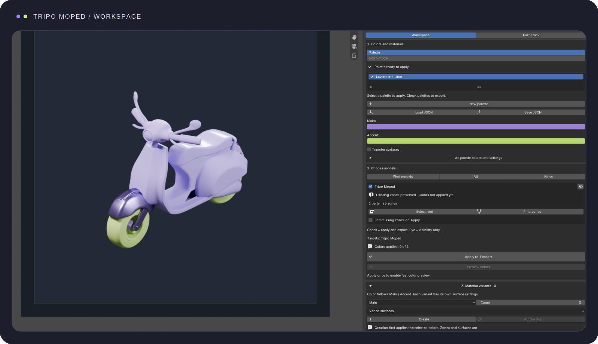
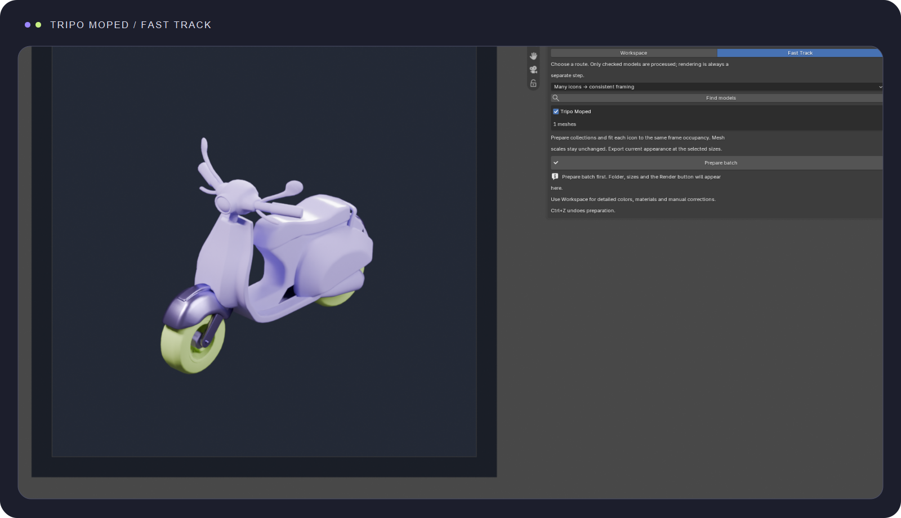

**Падрыхтуйце 3D-іконкі, пераносьце колеры і матэрыялы, экспартуйце серыі PNG.**

[Спампаваць](https://github.com/lomatoq/Color-Magic/releases/latest) · [Русский](README_RU.md) · [English](../README.md)

## Як гэта працуе

## У Blender

Мапед Tripo: артаграфічная камера, мяккае студыйнае святло Key / Fill / Rim і 23 захаваныя зоны.

Fast Track

## Усталяванне

У **Assets** апошняга выпуску спампуйце `Color_Prime_Studio_3.5.2_Universal.zip`, а не Source code. Не распакоўвайце. У Blender: **Edit → Preferences → Add-ons → Install** (3.6) або **Install from Disk** (новыя версіі). Уключыце Color Prime Studio; спачатку адключыце дублікаты. Захавайце працу і перазапусціце Blender. Адкрыйце **3D View → N → Color Prime**.

Праверана на Windows у **Blender 3.6.5 і 5.2.1 LTS**. Уверсе выберыце **EN / Бел**. Стандартныя вокны і падказкі Blender выкарыстоўваюць мову самога Blender.

## Хуткія сцэнарыі

| Задача | Што зрабіць |
| --- | --- |
| Адна іконка без перафарбоўкі | Fast Track → серыя іконак; адзначыць мадэль; падрыхтаваць; бягучыя колеры; папка і памер; рэндэр |
| Шмат іконак | Той жа маршрут, адзначыць усе патрэбныя мадэлі |
| Выгляд сейфа на скутэры | Fast Track → перанос паміж мадэлямі; выбраць крыніцу і атрымальнікаў |
| Мадэль з інтэрнэту без зон | Fast Track → імпартаваная мадэль; падрыхтаваць і знайсці адсутныя зоны |
| Дакладныя налады | Працоўная вобласць |

Fast Track **не запускае рэндэр аўтаматычна**. Серыя падганяе камеру пад кожную мадэль, не маштабуючы геаметрыю. Перанос капіруе колеры і паверхні; крыніца і Fixed захоўваюцца. Для пераносу толькі колераў у працоўнай вобласці выберыце крыніцу-мадэль і адключыце перанос матэрыялаў. Калі атрымальніку патрэбныя зоны, спачатку падрыхтуйце іх.

## Мадэлі, зоны і золата

Знайдзіце мадэлі або дадайце вылучаныя. Галочка азначае ўдзел у апрацоўцы/экспарце; вока — толькі бачнасць. Падрыхтоўка стварае або выкарыстоўвае калекцыю і корань `Anchor_<model>`, захоўваючы трансфармацыі і іерархію. Выдаленне радка спіса не выдаляе геаметрыю.

Захоўвайце існуючую разметку па змаўчанні. Пошук знаходзіць адсутныя зоны, а яўнае перастварэнне можа змяніць межы. Аўтаматычны алгарытм не ведае мастацкай задумы: складаныя сеткі правярайце і выпраўляйце ўручную.

Выберыце аб'екты або грані і прызначце **Main**, **Accent** або **Fixed**. Напрыклад, корпус — Main, ручкі — Accent, манеты — Fixed. Тэкстурны шэйдар можа патрабаваць яўна выбраны бяспечны ўваход колеру; для нязменнага выгляду выкарыстоўвайце экспарт бягучых колераў.

## Палітры і экземпляры

Стварыце палітру з назвай або вазьміце яе з мадэлі. Першае прымяненне рыхтуе прывязкі колераў для адзначаных мадэляў. Потым папярэдні прагляд мяняе агульныя крыніцы колеру без паўторнага пошуку зон. Аднаўленне скасоўвае прагляд, прымяненне пакідае вынік.

У экземплярах выберыце Main/Accent, колькасць і паверхні. **Стварыць** дадае матэрыялы ў бібліятэку; **Аўтапрызначыць** размяшчае іх на зонах. Можна прызначаць уручную. Пасля змены паверхні можа спатрэбіцца паўторнае прызначэнне — стан паказаны ў панэлі. Колер наследуецца звычайнымі нодамі Blender; даступныя шэйдар і карэкцыя адцення.

JSON захоўвае колеры, назвы, парадак і галочкі палітры. Матэрыялы з нодамі, мадэлі і прызначэнні захоўвайце ў **`.blend`**. Ctrl+Z — адмяніць, Ctrl+S — захаваць.

## Экспарт

Для нязменнага выгляду выберыце бягучыя колеры мадэлі. Для серыі выберыце палітры працоўнай вобласці і ўсе камбінацыі. Чарга: Main × Accent × мадэлі × памеры. **10 × 10 × 1 × 3 = 300 PNG**. Ёсць і папарны рэжым.

Адзначце 1x/2x/3x, уласны дробны маштаб або абсалютныя памеры. Праверце пікселі, колькасць файлаў і прыклад шляху перад запускам. Папкі пачынаюцца з мадэлі, далей Main/Accent; назва PNG змяшчае мадэль, колеры і памер. Перазапіс існуючых файлаў трэба ўключаць яўна.

Мадэлі рэндэрацца па адной. Астатнія часова хаваюцца; колеры, бачнасць і часовыя налады аднаўляюцца пасля чаргі. Ракурс, палі кадра, святло і фон — у блоку камеры і святла. Фонавая плоскасць і празрыстасць PNG незалежныя.

## Абнаўленне і адкат

Націсніце **Праверыць абнаўленні**. Для новага стабільнага выпуску з'явіцца кнопка ўсталявання. Спампоўванне і праверка выконваюцца без блакавання інтэрфейсу. Правяраюцца ZIP, SHA256 і ўнутраныя хэшы, захоўваецца рэзервовая копія. Сцэна не змяняецца. **Захавайце працу і перазапусціце Blender.**

Патрэбны доступ да GitHub і права запісу ў каталог адона. Падчас рэндэру абнаўленне недаступнае. Асноўная праца лакальная, без сеткі. Хэшы выяўляюць пашкоджанні, але не з'яўляюцца незалежным лічбавым подпісам.

Рэзервовыя ZIP — у `.color_prime_backups` побач з каталогам адонаў; поўны шлях друкуецца ў сістэмнай кансолі. Для адкату ўсталюйце рэзервовы ZIP або папярэдні выпуск праз Preferences, затым перазапусціце. Не ўключайце дзве копіі адначасова.

## Калі не працуе

| Праблема | Дзеянне |
| --- | --- |
| Няма панэлі | Уключыць адон; адкрыць 3D View; N; перазапусціць пасля ўсталявання |
| Змешаная ўстаноўка / дублікат | Адключыць іншыя копіі, перазапусціць, усталяваць поўны ZIP выпуску |
| Мадэль не знойдзена | Выбраць яе корань/мешы і дадаць вылучанае; праверыць калекцыі і Empty |
| Кнопка недаступная | Прачытаць стан і падказку; праверыць галочкі, Object Mode і бягучыя аперацыі |
| Auto Setup / няма ўваходу колеру | Бягучы выгляд не патрабуе перафарбоўкі; для палітры падключыць Main/Accent да бяспечных уваходаў |
| Золата мяняецца | Пазначыць Fixed перад прымяненнем; пры патрэбе Ctrl+Z |
| Дрэнныя зоны | Захаваць існыя межы і паправіць выбраныя дэталі ўручную |
| Экземпляры не бачныя | Пасля стварэння прызначыць аўтаматычна або ўручную |
| Павольная змена колеру | Пасля першага прымянення выкарыстоўваць прагляд, не шукаць зоны нанова |
| Выдалена студыя | Стварыць/аднавіць камеру і святло ў адпаведным блоку |
| Пусты кадр | Праверыць камеру, святло і бачнасць у рэндэры; падрыхтаваць студыю |
| Экспарт спыніўся | Праверыць памылку, месца, правы папкі і канфлікты назваў; дачакацца аднаўлення |
| Абнаўленне не працуе | Праверыць сетку і правы; усталяваць ZIP уручную; падрабязнасці ў кансолі |
| Старая версія пасля ўсталявання | Захаваць файл і цалкам перазапусціць Blender |

У [Issues](https://github.com/lomatoq/Color-Magic/issues) пазначце версіі, крокі, чаканы вынік і traceback. Не публікуйце прыватныя шляхі або мадэлі без дазволу.

## Зборка

`python tools/build.py` стварае ZIP і SHA256 у `dist`. Пасля змен Python патрэбна паўторная зборка для абнаўлення маніфеста. Тэсты — у `tests`; гістарычным сцэнавым праверкам патрэбныя асобныя мадэлі. Правераныя сцэнарыі не гарантуюць працу кожнага старонняга шэйдара. Ліцэнзія: [GNU GPL v3](../source/color_prime/LICENSE), захаваная з зыходнага пакета адона.
